# Hogwarts_Houses

Hogwarts School of Witchcraft 
and Wizardry needs a little bit of my
Muggle technology, to make the 
management of this enormous castle 
less of a headache. Dumbledore asked me to create an API 
to assign Hogwarts students to a room of a specific house. 

### Built with
- Spring boot
- h2 Database
- Java

### Code Snippets

Hermine and Draco came too late and I have to assign them to there room of their Hogwarts house. I also have to consider that in Hogwarts the rooms are seperated between female students and male students. 

*add the name of the student as path of the endpoint to the url*
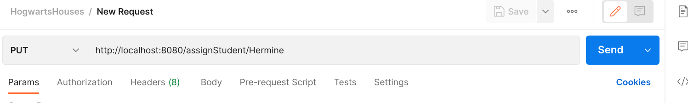
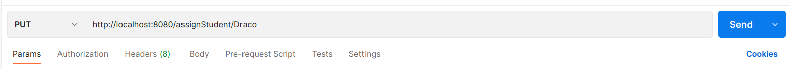

*Put request to assign Student to their correct house*
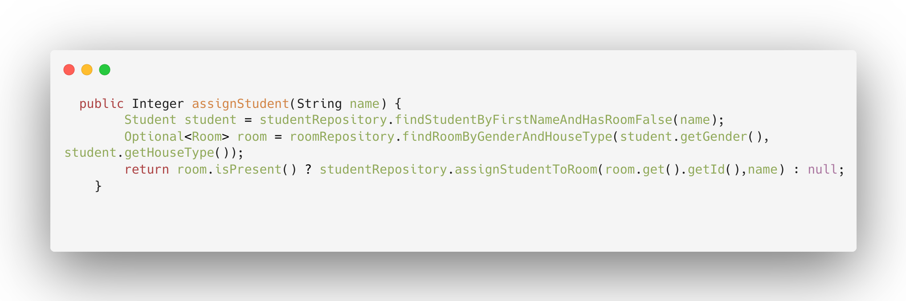

*In roomrepository interface which extends the JpaRepository, 
methods and queries are responsible to find a room of their Hogwarts house.
So is Draco in Slytherin house and Hermine in a house of 
Gryffindor.*

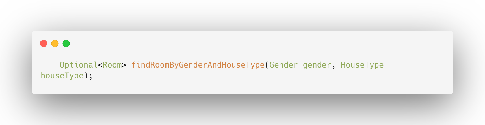

*At same time the amount of available 
beds of the room gets also updated*

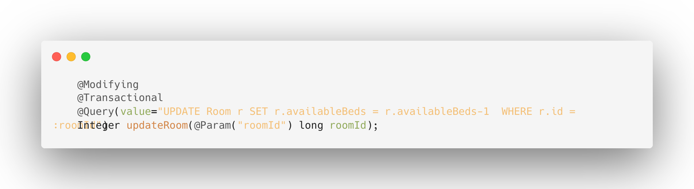

Ron has a rat as house animal. 
So he can't stay in a room where one of the students has a cat.

Ron can be assigned as path of the url
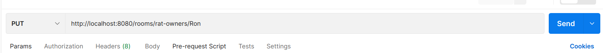

Luckily neither Harry and Neville have a cat as house animal so Ron can stay with them

Before put request

After put request
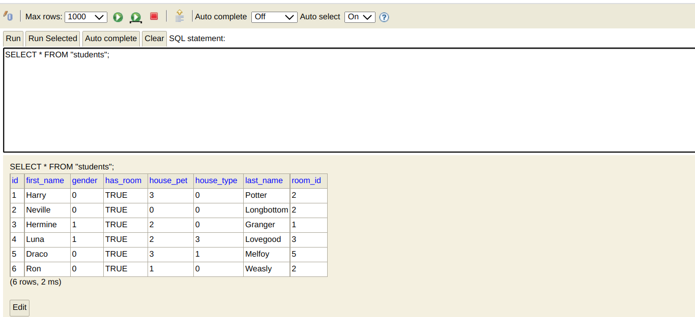

Ron is now assigned to the same room as Harry and Neville and his status of has_room is also updated.  

To connect the entity Student and entity Room with each other , the bidirectional association is used
To not get an error of infinite recursion annotation of  "@JsonManagedReference" in the Room entity class and
"@JsonBackReference" in the Student entity class are used. 

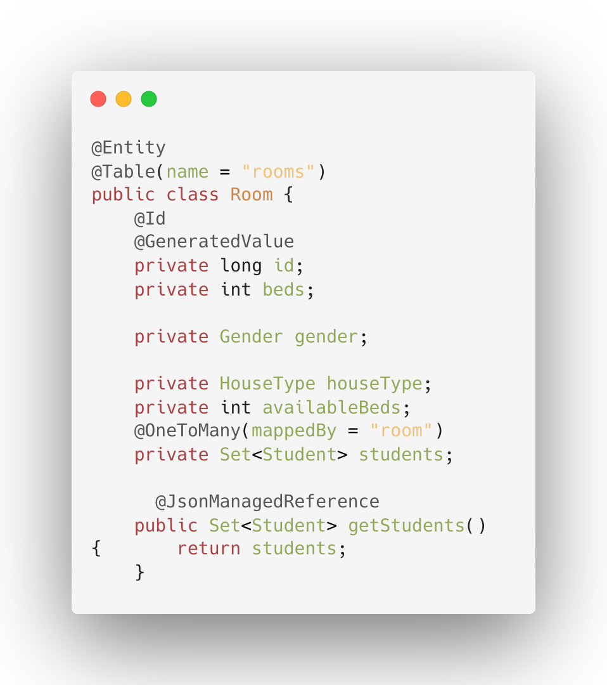

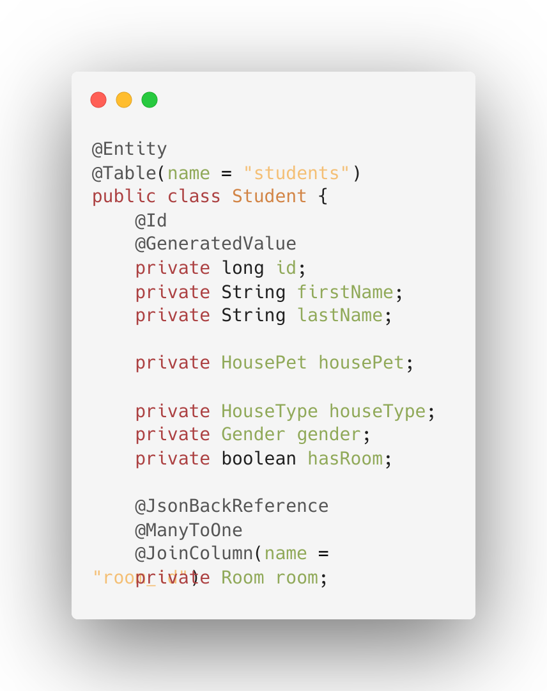

### Tests
To test the endpoints WebMvcTest is used. 

## Tests for the enpoints codesnippet
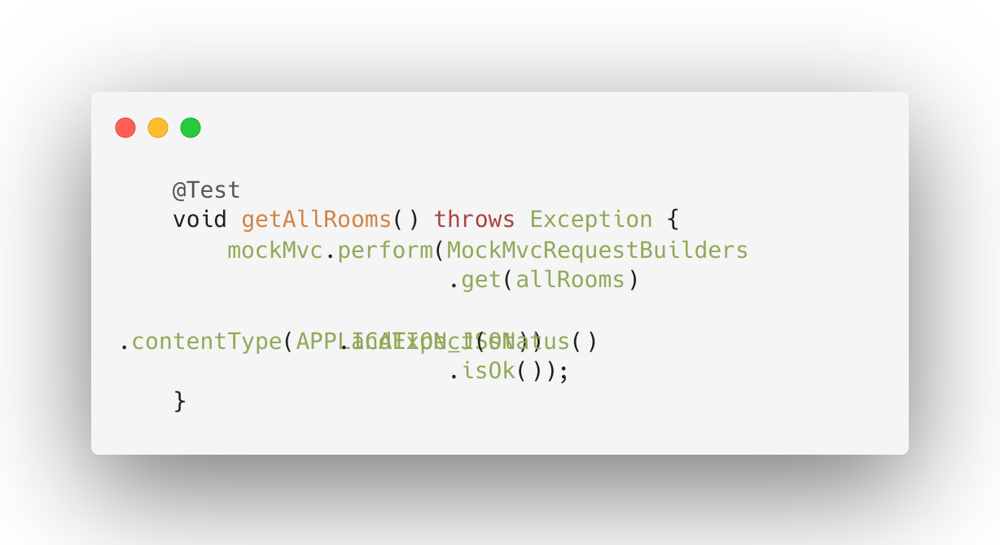

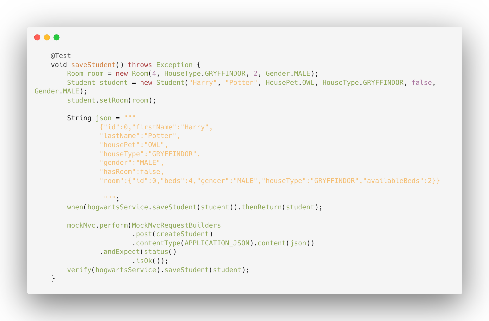

## Test for the HogwartsService class codesnippet

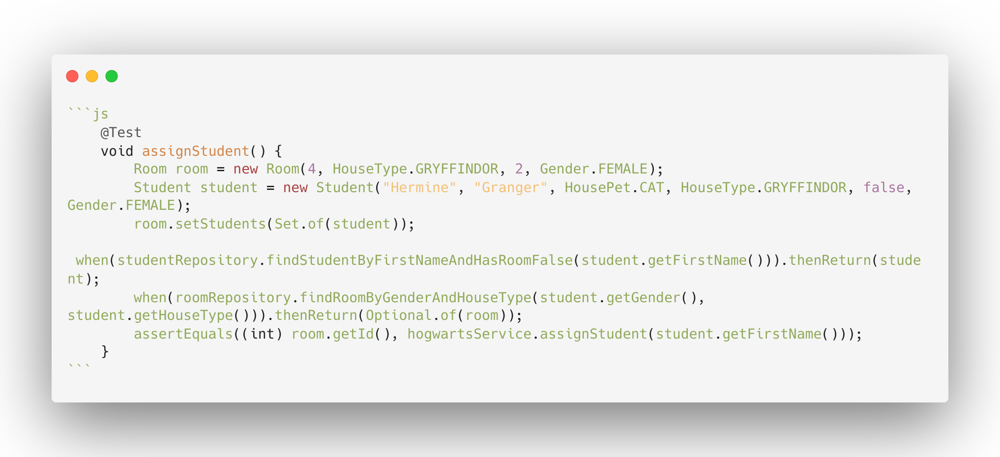
